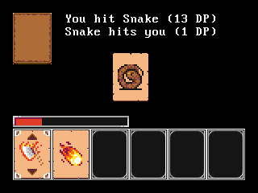
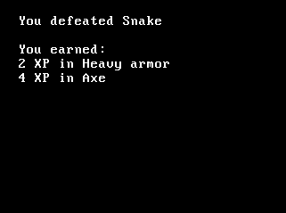
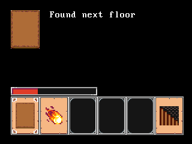
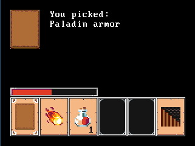
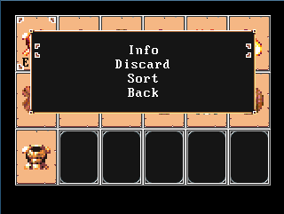
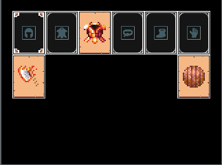

# CardRogue

Rogue like game in the shape of a card game.

## Goal

Go down a dangerous dungeon to find a rare artefact and come back up, alive.

## Gameplay

Pick cards to fight enemies, to loot items and to find your way through the
dungeon.

If the picked card is an enemy, you have the choice to fight it, or to attempt
to escape

If the picked card is an object, you have the choice to pick it or to discard
it.

To go to the next dungeon floor, you need to find a floor card. When you have
it, you can choose to either carry on roaming the current floor for more loot
and fight for more XP until you feel ready.

## More technical points

The game is developed for the handheld opendingux console GCW-Zero
(http://www.gcw-zero.com/), and so runs at a resolution of 320x240px.

It can be compiled to run on (and is tested on) Unix, but remember that the
game window is rather small.

Nonetheless, if you own no GCW-Zero (or other opendingux console), you can test
it on the computer. The mappings are described below.

### Key mappings

- Pick a card/Action: **RETURN**
- Move cursor: **Arrows**
- Go to inventory: **I**
- Go to equipment: **E**

## Screenshots

## Footnotes

This game is being developed and therefore, some features might change in time.
